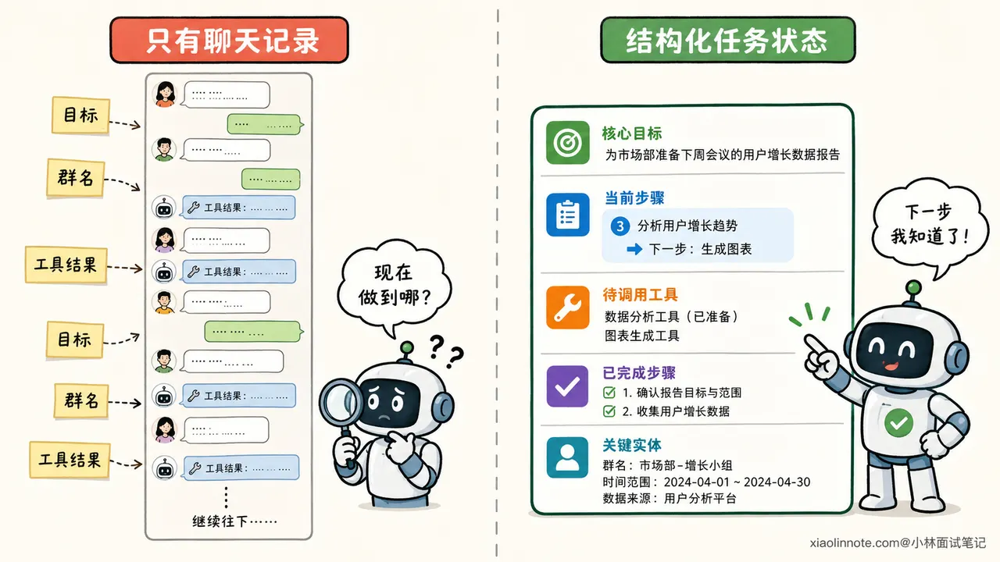
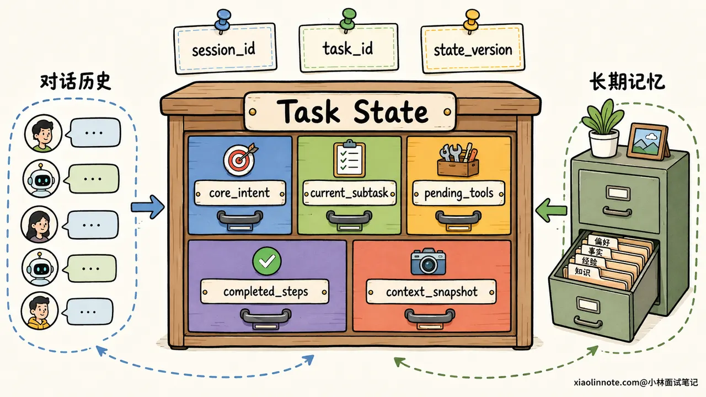
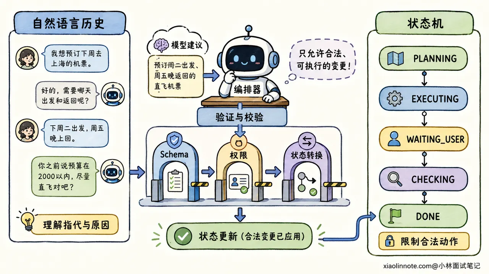
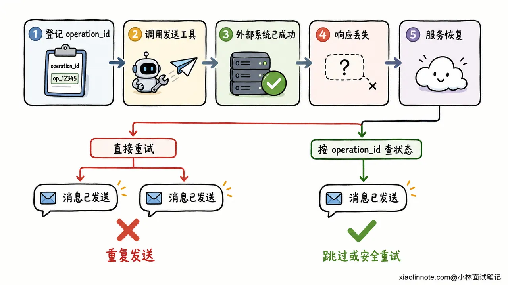

# 18. Agent 的多轮对话状态如何管理？如何防止跑偏并支持中断恢复？

> 来源：[https://xiaolinnote.com/ai/agent/18_session_state.html](https://xiaolinnote.com/ai/agent/18_session_state.html)

---

# 18. Agent 的多轮对话状态如何管理？如何防止跑偏并支持中断恢复？

👔面试官：一个 Agent 要连续聊几十轮，还要执行复杂任务，你会怎么管理它的对话状态？

🙋‍♂️我：把所有历史消息都存进 Redis，每次完整传给模型，它就知道前面聊过什么了。

👔面试官：历史消息只是原始记录。任务目标、当前步骤、待调用工具和已经完成的动作都埋在自然语言里，模型每一轮都要重新猜。对话一长，不仅 Token 会爆，任务还很容易跑偏。

🙋‍♂️我：那我把第一轮需求保存成 `core_intent`，以后永远不允许修改，这样就不会跑偏了。

👔面试官：如果用户明确说「刚才的任务先暂停，改成帮我订明天的票」呢？防跑偏不是不许用户换任务，而是不允许系统在用户没有授权时悄悄改目标。

🙋‍♂️我：明白了。再给每一步做 checkpoint，服务挂了以后从 checkpoint 继续执行，应该就能恢复了。

👔面试官：如果发送消息这个工具其实已经成功，只是响应在网络上丢了，恢复后再执行一次，不就发了两遍？只会保存状态还不够，你还得讲清楚恢复边界、幂等和外部副作用核对。

这道题考的是怎样把一段自然语言对话，变成一条可控、可追踪、可安全恢复的任务链。「聊天记录存在哪」只是最基础的一层。

## 💡 简要回答

我会先把信息分成四类，而不是把所有内容都塞进 `messages`：对话历史保留用户和模型说过的原话，业务状态保存已经确认的实体与约束，任务状态记录目标、当前步骤和工具执行进度，长期记忆只保存跨任务仍然有价值的用户偏好与历史经验。

当前任务里，我会显式维护 `core_intent`、`current_subtask`、`pending_tools`、`completed_steps` 和 `context_snapshot`。每轮先判断用户输入是在补充、纠错、回答澄清问题，还是明确切换任务，再更新结构化状态。`core_intent` 是意图锚点，模型不能自行覆盖，但用户确认换题时可以创建新任务，或者生成一个新版本。

执行层用状态机控制合法流转，例如 `PLANNING -> EXECUTING -> WAITING_USER -> CHECKING -> DONE`。自然语言历史负责保留语气、原因和细节，状态机负责决定现在能做什么，两者配合，不能互相替代。

为了支持中断恢复，我会按 `session_id` 或 `thread_id` 隔离会话，再用 `task_id` 标识具体任务，在关键步骤保存 checkpoint。恢复时加载最近一次已提交状态，并核对未决工具调用。所有写外部系统的动作都要带稳定的幂等键，不能简单地从失败位置再执行一遍，否则可能重复付款、重复发消息。

## 📝 详细解析

### 为什么把聊天记录全塞给模型还不够？

先看一个很常见的任务。用户第一轮说：「帮我总结这篇文章，确认后发到技术交流群。」中间又补了一句：「语气正式一点。」随后 Agent 查文章、写摘要、询问群名，服务却在发送前重启了。

如果系统只有一长串聊天记录，恢复后模型要自己从几十条消息里猜四件事：最终目标是什么、文章是否已经获取、摘要是不是最终版、消息到底发没发。历史越长，错误信息、旧版本结果和工具日志越容易混在一起。

所以，多轮状态管理不能等同于「保存对话历史」。对话历史是证据，结构化状态才是当前结论。前者告诉我们事情是怎么聊到这里的，后者直接告诉执行器现在做到哪里。



### 四类信息为什么要分开管理？

这四类信息看起来都和「记住」有关，但生命周期和用途完全不同。

| 信息类型 | 主要内容 | 典型生命周期 | 主要用途 |
| --- | --- | --- | --- |
| 对话历史 | 用户原话、模型回复、工具返回 | 当前会话 | 还原语义、指代、语气和决策原因 |
| 业务状态 | 日期、金额、目标群、审批结果等已确认事实 | 当前业务任务，部分可更久 | 给业务规则和工具提供可信参数 |
| 任务状态 | 核心目标、当前子任务、待办、步骤状态、错误信息 | 一次任务执行 | 控制流程、重试、暂停与恢复 |
| 长期记忆 | 用户偏好、稳定背景、可复用经验 | 跨会话、跨任务 | 个性化与历史经验召回 |

为什么一定要拆？因为同一句话放错位置，后果完全不同。

用户说「这次报告用英文」，它可能只是当前任务的业务约束，不应该直接写成「用户永远偏好英文」的长期记忆。工具返回「订单创建成功」，则不能只躺在聊天历史里，它还要更新任务步骤状态，并记录订单号，供恢复时核对。

这里也能看出本题和 Memory 基础题的区别。Memory 更关心哪些信息值得跨任务保留、怎么召回；状态管理更关心正在执行的这件事走到了哪里，下一步是否合法，故障后如何接着走。

### 一份可用的任务状态应该有什么？

状态字段不是越多越好，关键是让系统不用重新阅读全部历史，也能回答「为什么做、做到哪、还差什么」。一份通用的状态可以围绕下面几个核心字段设计。

| 字段 | 记录什么 | 更新原则 |
| --- | --- | --- |
| `core_intent` | 归一化后的核心目标、范围、约束和完成标准 | 模型不能自行覆盖，用户明确改需求时版本化更新 |
| `current_subtask` | 当前正在处理的一个子任务 | 步骤开始或切换时更新 |
| `pending_tools` | 尚未完成的工具调用及其调用编号、参数摘要、状态 | 先登记再执行，拿到结果后改为成功、失败或未知 |
| `completed_steps` | 已完成步骤的结论、证据引用和产物位置 | 只记可复用结论，不复制整段原始日志 |
| `context_snapshot` | 当前有效的用户、时间、地点、文件、订单号等实体 | 新信息经过校验后合并，保留来源与版本 |

除此之外，工程上通常还会有 `session_id`、`task_id`、`turn_id`、`state_version`、当前流程阶段、更新时间和最后错误等字段。

`session_id` 或 `thread_id` 标识一段连续交互，`task_id` 标识会话中的某个具体任务。为什么要再分一层？因为一个会话里可能先做报告，又临时查天气，随后继续原任务。如果只拿会话编号当任务编号，两个任务的状态很容易搅在一起。

`state_version` 也很重要。用户连续发来两条补充消息，或者两个 Worker 同时处理同一任务时，可以用版本号做乐观锁或比较后更新，避免较晚写入的旧状态把新状态覆盖掉。



### 每来一条新消息，状态怎么更新？

用户的新消息不能直接追加到历史后就交给 Agent 自由发挥。更稳妥的做法，是先判断它和当前任务是什么关系。

如果用户说「语气正式一点」，这是补充约束，应更新 `context_snapshot`，原目标不变。如果用户说「不是技术群，是产品群」，这是纠错，要覆盖目标群这个槽位，并让依赖旧群名的待执行步骤失效。如果用户只是回答 Agent 上一轮询问的「请告诉我群名」，就应该解除 `WAITING_USER`，继续原任务。

用户切题时最容易误判。比如他突然问「对了，北京明天天气怎么样？」系统不能只靠与第一轮输入的向量相似度低，就认定 Agent 跑偏。用户可能是在切换任务，也可能只是为了原任务补充信息。

所以，意图锚点更适合作为预警信号，而不是最终裁判。系统应该结合当前步骤、待澄清问题、指代关系和用户是否明确使用「暂停」「改成」「另外」等表达，把新输入分成四类：补充、纠错、澄清回复和新任务。置信度不够时就问一句，而不是擅自改状态。

一旦确认是新任务，可以暂停旧 `task_id` 并创建新任务，也可以由产品规则决定结束旧任务。用户后来要求继续时，再恢复旧任务的 checkpoint。

这里要特别纠正一个误区：`core_intent` 的「锁定」不是永远保存第一句话。第一轮需求可能含糊，也可能在后续被用户合法修改。合理做法是先把需求归一化为目标、约束和验收条件，必要时让用户确认；之后禁止模型静默改写，用户明确修改时则生成新的意图版本，并记录修改来源。

### 状态机和自然语言历史，谁说了算？

只有结构化状态，系统可能丢掉用户为什么这样决定的细节；只有自然语言历史，流程又会变成每轮重新猜。最稳妥的方式，是让两者各做擅长的事。

自然语言历史负责理解。例如用户说「还是按上周那个风格来」，模型需要结合近几轮消息和检索到的相关记忆，才能明白「那个风格」指什么。

状态机负责执行。例如任务当前处于 `WAITING_CONFIRMATION`，那么即使模型突然建议调用发送工具，执行器也应该拒绝，只有收到有效确认后才能进入 `EXECUTING`。像付款、发送、删除这类高风险动作，合法状态转换应该由确定性代码校验，不能只靠 Prompt 约束。

一个简化流程可以是：

```
IDLE -> PLANNING -> EXECUTING -> CHECKING -> DONE
                    |              |
                    v              v
               WAITING_USER      ERROR
```

这里的模型可以提出「更新哪些字段、下一步建议去哪里」，但输出必须经过 Schema 校验、权限校验和状态转换校验。最终提交状态的是编排层，不是模型自己。

每一轮调用模型时，也不需要把数据库里的所有内容都拼进去。更合理的上下文通常由系统规则、`core_intent`、当前子任务、关键状态快照、最近相关对话、上一步工具结果和按需召回的长期记忆组成。旧聊天可以摘要，原始工具大结果可以落到外部存储，只在状态里保留引用。



### 怎样用意图锚点防止越聊越偏？

Agent 跑偏通常不是突然忘掉整项任务，而是在多次小偏差中慢慢发生。工具返回了一段无关内容，模型顺着展开；用户插入一个临时问题，Agent 回答完却忘了主线；摘要反复压缩以后，验收条件被压没了。这些都不是单纯增加历史长度能解决的。

第一道防线是始终保留结构化的 `core_intent`。它不只是一句任务标题，还应该包含最终产物、必须满足的约束和完成标准。每次规划或检查前，把它和 `current_subtask` 一起提供给模型，让模型知道当前步骤为什么存在。

第二道防线是做进度核对。每完成一个关键步骤，Checker 都要问两个问题：这个结果是否推进了核心目标，下一步是否仍来自未完成计划。若连续步骤与目标弱相关、重复修改同一状态，或者新计划无故丢掉验收条件，就进入重新规划或人工澄清，而不是继续消耗 Token。

第三道防线是保留事实来源和状态版本。工具结果出错时，不应该让后面的摘要把错误结论包装成确定事实。`context_snapshot` 里的关键字段可以带上来源、置信度和更新时间，用户纠正后让依赖旧值的步骤失效，再从受影响的位置重新规划。

至于固定每五轮摘要、超过二十轮强制重对齐，可以作为工程策略，但不是普适定律。更合理的触发条件是 Token 预算、任务阶段变化、关键状态更新和偏航风险。短任务没必要机械摘要，长任务也不能等到固定轮数才检查。

### 中断以后，怎样恢复到正确位置？

Checkpoint 不只是把一份字典随手写进 Redis。它至少要回答三个问题：这是哪个用户的哪个任务，保存的是哪一个一致状态，恢复后哪一步可以安全执行。

每个关键步骤完成后可以提交一次 checkpoint。对于外部写操作，更稳妥的边界是「执行前登记意图，执行后记录结果」。例如准备发送群消息时，先把工具调用记为 `planned`，生成稳定的 `operation_id`；真正发送成功后，再保存平台返回的 `message_id`，把状态改成 `succeeded`。

恢复时大致按下面的顺序处理：

1. 用可信身份校验 `session_id` 或 `thread_id`，再定位 `task_id`，防止读取到别人的任务。
2. 加载最近一次完整提交的 checkpoint，校验状态版本和工作流版本，不能把旧结构直接喂给新代码。
3. 查看 `pending_tools`，把 `succeeded` 的步骤跳过，对明确 `failed` 的步骤按策略重试，对 `unknown` 的步骤先去外部系统核对。
4. 重新组装最小必要上下文，包括系统规则、核心意图、当前任务状态、最近相关对话、关键工具结果和必要的长期记忆。
5. 从合法状态继续执行，并记录这次恢复的来源、次数和结果，方便审计与排障。

为什么会出现 `unknown`？假设群消息已经发出，但工具响应还没写回状态时进程崩了。此时系统只知道调用开始过，却不知道结果。若恢复后直接重试，用户可能收到两条一模一样的消息。

解决这类问题，不能迷信所谓「恰好执行一次」。跨网络、跨系统时，更实际的办法是让副作用可幂等：使用稳定的业务幂等键，外部接口支持按键去重；数据库写入采用唯一约束或 upsert；发送类动作保存去重记录，并优先按 `operation_id` 查询执行结果。

如果外部系统既不能查询，也不支持幂等，恢复程序就不该盲目重发。它可以把状态转入人工确认，明确告诉用户「上次发送结果无法确认」，由人决定是重试还是跳过。



### 线上实现还要补哪些细节？

状态存储可以按冷热分层。活跃会话放在 Redis 之类的低延迟存储里，关键 checkpoint 和审计记录落到持久化数据库或对象存储。TTL 可以清理已结束、可重建的会话缓存，但不能让仍在等待审批的长期任务因为半小时无人说话就直接消失。

多实例并发时，还要防止同一个任务被两个 Worker 同时推进。常见办法是按 `task_id` 加租约或分布式锁，配合 `state_version` 做比较后更新。每条用户请求也应该有 `request_id`，重复提交时能直接返回之前的处理结果。

状态里不要长期保存所有原始工具结果，更不能把密码、令牌和不必要的敏感信息塞进去。大结果存外部，只保留摘要、哈希和引用；日志和 Trace 也要脱敏，并按租户和用户做访问隔离。

最后还要能观测这套机制是不是真的有效。除了任务完成率，可以看意图改写次数、澄清率、非法状态转换次数、恢复成功率、重复副作用次数、从中断到恢复的耗时，以及恢复后结果与不中断基线的一致性。

## 🎯 面试总结

回答这道题，我不会把状态管理简单说成「把历史消息存进 Redis」。我会先把对话历史、业务状态、任务状态和长期记忆分开，因为它们解决的是不同问题。

当前任务用 `core_intent` 锚定目标，用 `current_subtask`、`pending_tools`、`completed_steps` 和 `context_snapshot` 显式记录执行进度。每轮先判断用户是在补充、纠错、回答问题还是切换任务。模型可以提出状态更新，状态机和确定性校验负责最终放行。

防跑偏也不是死守第一句话。`core_intent` 防的是模型静默改目标，用户明确修改时应该版本化更新，或者创建新的 `task_id`。自然语言历史保留细节，结构化状态保存当前结论，两者缺一不可。

中断恢复则要说到 checkpoint、`session_id` 或 `thread_id`、`task_id` 和幂等。恢复时先加载最近一致状态，再核对未决工具调用；对付款、发消息、创建订单等外部副作用，使用稳定幂等键和结果查询，绝不能看到步骤没写成成功就直接重跑。

---

对了，AI Agent的面试题会在「**公众号@小林面试笔记题**」持续更新，林友们赶紧关注起来，别错过最新干货哦！


