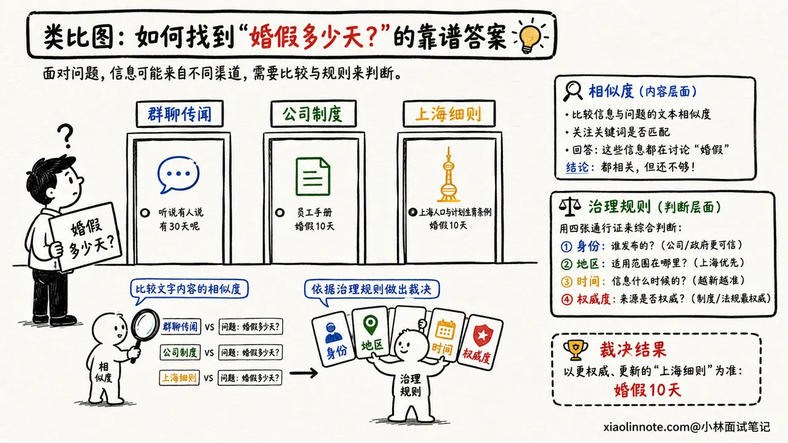
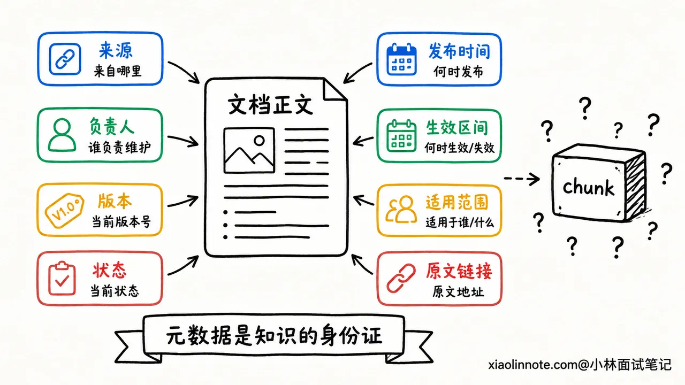
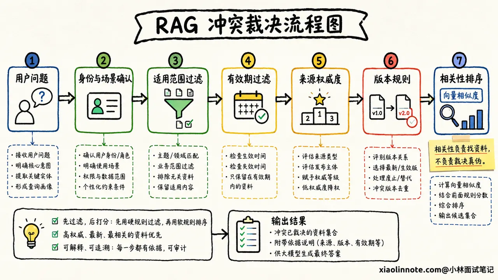
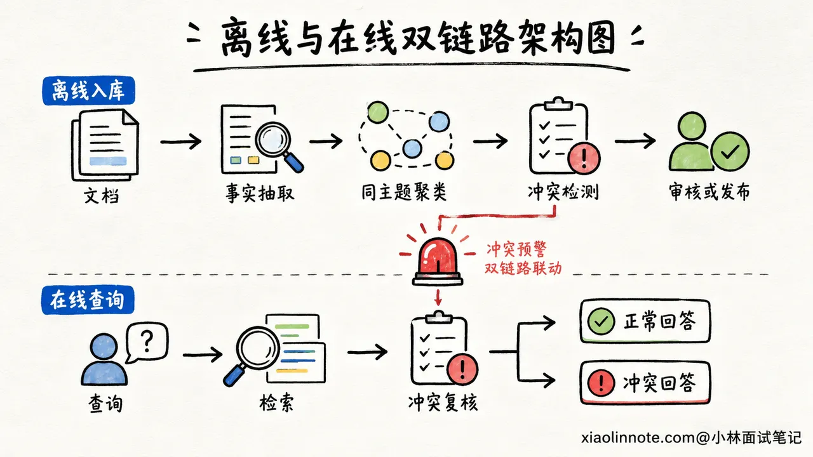
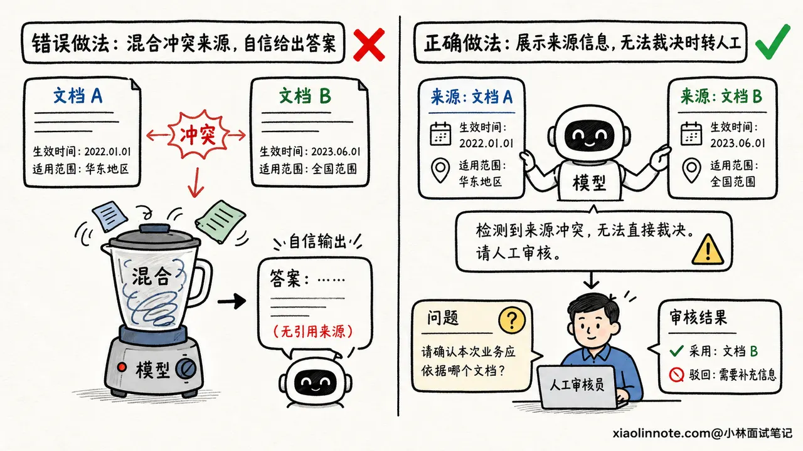
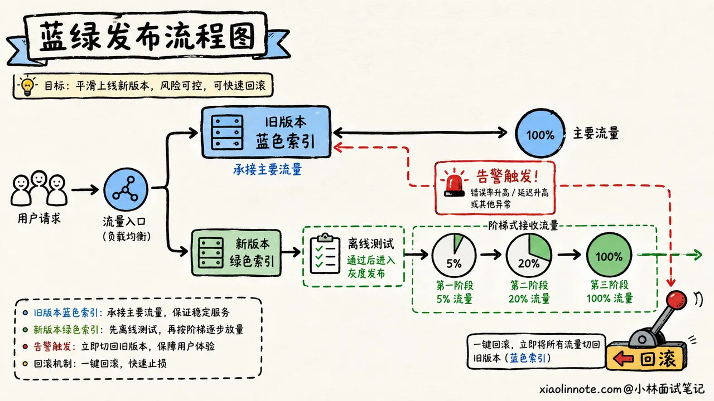

# 21. 不同来源的文档发生知识冲突时，RAG 应该信谁？

> 来源：[https://xiaolinnote.com/ai/rag/21_knowledge_conflict.html](https://xiaolinnote.com/ai/rag/21_knowledge_conflict.html)

---

# 21. 不同来源的文档发生知识冲突时，RAG 应该信谁？

👔面试官：知识库里两份文档说法不一样，RAG 应该信谁？

🙋‍♂️我：信向量相似度最高的那份，检索分数最高说明它和用户的问题最相关。

👔面试官：相关不代表正确。群聊截图可能和问题一字不差，正式制度只用了另一种表达，难道你要让群聊覆盖公司制度？

🙋‍♂️我：那就永远信发布时间最新的文档，新文档肯定已经修正了旧文档。

👔面试官：总部今天发布的通用规则，能覆盖还在有效期内的上海地区细则吗？发布日期新，也不代表适用范围更准确。

🙋‍♂️我：那让大模型把两份文档读一遍，自己判断哪份更可信。

👔面试官：你既没有给它权威等级，也没有给版本状态和适用范围，它拿什么判断？生产系统不能把知识治理责任甩给一次随机生成。

这道题看起来在问模型该选哪段文字，实际上考的是：知识库有没有一套能解释、能审核、能回滚的知识治理规则。

## 💡 简要回答

遇到知识冲突时，我不会直接选择向量相似度最高的文档，因为相似度只能说明内容和问题相关，不能证明它更权威、更及时，也不能证明它适用于当前用户。

我的处理顺序是先看适用范围，再看来源权威度、版本状态和生效时间。入库时要保存来源、负责人、发布时间、生效区间、版本、地区、产品和状态等元数据；检索时先按用户、地区、产品和时间做过滤，再在适用的文档中召回和排序。

如果两份同等权威且同时有效的材料仍然矛盾，系统不应该偷偷二选一，而要明确告诉用户存在冲突，分别引用两边的依据，必要时转人工审核。工程上还要有冲突检测、灰度发布、版本回滚和专项评测，保证错误知识不会悄悄进入生产答案。

## 📝 详细解析

### 为什么不能选择「相似度最高」的文档？

先来看一个很真实的场景。用户问：「今年婚假有多少天？」知识库检索出了三段内容。

第一段来自员工群聊，内容写着「听说婚假改成 15 天了」；第二段来自公司正式制度，写着「婚假为 10 天」；第三段来自上海地区补充规则，写着「上海员工按 15 天执行」。

如果用户问题里刚好出现「15 天」，群聊消息很可能得到更高的向量相似度。但它只是传闻，不是能执行的正式依据。即使公司制度更权威，如果提问者是上海员工，地区细则又可能比总部通用规则更适用。

这说明检索分数只回答「像不像」，没有回答「该不该信」。知识冲突至少要看四个维度：内容是否适用于当前场景，来源是否权威，版本是否有效，时间是否仍在生效区间。

### 入库时不只存正文，还要存「身份证」

冲突发生后才让模型猜谁可信，通常已经晚了。真正有效的办法，要从文档入库时开始。

每个文档和 chunk 除了正文、向量之外，还应该带上能支持裁决的元数据。比如 `source_id` 表示从哪个系统同步，`owner` 表示谁负责，`version` 表示版本号，`status` 区分草稿、已生效、已废止，`published_at` 和 `effective_from`、`effective_to` 分别记录发布时间与生效区间。

为什么发布时间和生效时间要分开？因为下个月才生效的新制度，发布时间虽然最新，今天却不能执行；一份去年发布但有效期仍未结束的地区细则，也不能被今天刚发布的通用通知随便覆盖。

适用范围同样重要。地区、产品版本、客户等级、部门、租户、语言和权限范围，都可能决定一段知识对谁有效。没有这些字段，系统只能看到两段互相矛盾的文字，却不知道它们可能各自在不同场景下成立。

此外，还要保存原文链接、文档 hash 和审批记录。这样生成答案时能引用原文，发现问题时也能追到是谁、在什么时候、通过什么流程把它发布进来的。

### 先判断适用范围，再比较谁更权威

有了元数据，系统还需要一套明确的裁决顺序。我更倾向于先做适用性判断，因为一份再权威的文档，如果不适用于当前用户，也不能拿来回答。

系统可以先根据用户身份和问题上下文确定地区、产品、时间、部门等条件，把明显不适用、已经过期或尚未生效的文档过滤掉。接着再比较来源权威度，例如经过审批的正式制度通常高于内部知识文章，内部知识文章高于群聊和个人笔记。

同一权威层级内，再看版本状态和生效时间。明确标记为「已废止」的旧版本不能因为文字更相似就返回；同一制度的多个有效修订版，则按组织事先定义的版本规则处理。

需要注意，权威顺序不能由开发人员拍脑袋写成全公司的统一常量。财务、法务、产品和售后可能各有自己的知识负责人和效力层级。更稳妥的做法是维护一个来源注册表，由业务负责人定义各领域的来源等级、覆盖关系和审批流程。

### 冲突应该怎样被发现？

知识库不能等用户指出答案矛盾以后才发现问题。离线入库和在线检索两个阶段，都应该设置冲突检测。

离线入库时，可以先按实体、主题和适用范围把内容聚在一起。例如把所有「婚假天数」「退款期限」「接口超时时间」相关的片段归成一组，再抽取其中的关键事实。若同一适用范围、同一有效期内出现「10 天」和「15 天」这类不同取值，就标记为待审核，不要直接让新文档进入正式索引。

对于结构化程度高的知识，规则比大模型更可靠。数字、日期、状态和版本号可以先用字段解析与数据库约束比较。自然语言表述比较复杂时，可以用模型做矛盾候选识别，但模型输出只能作为告警线索，不能自动决定谁胜出。

在线阶段也要留一道保险。如果一次检索返回了多个高分片段，它们针对同一个事实给出互斥结论，系统要把「存在冲突」作为一种正式状态传给生成层，而不是把这些片段混在 Prompt 里，赌模型恰好选对。

### 检索阶段和生成阶段分别做什么？

冲突治理不能只靠一层完成。检索阶段的任务，是尽量把「适用而且可信」的候选证据交给模型。

具体来说，先用 metadata filter 排除权限不匹配、地区不匹配、已经过期的内容，再做向量和关键词召回。排序时除了相关性分数，还要考虑权威度、时效、版本状态和适用性。这里不一定要强行压成一个万能公式，很多业务规则用硬过滤和分层排序反而更容易解释。

生成阶段的任务，是忠实地使用这些证据。Prompt 要求每个关键结论带上来源与版本，不允许用模型自身常识覆盖正式材料；如果证据只支持部分结论，就只回答能被支持的部分。

如果高权威资料已经给出唯一有效结论，模型应明确引用它，并在必要时说明旧资料已废止。如果两份证据权威性相当、适用范围相同，而且系统确实无法裁决，就要诚实呈现：「当前知识库存在两个不同版本，A 文档在某日规定为 10 天，B 文档在某日规定为 15 天，暂时无法确认哪一个有效。」随后给出原文链接，询问用户补充地区或版本，或者转交知识负责人审核。

这类回答看起来没有直接替用户下结论，却比模型随机选一个答案安全得多。尤其是医疗、金融、法务和内部制度场景，「不知道」是一种必要能力。

### 如何让错误知识可以灰度、可以回滚？

即使有审核流程，新版本也可能带来新的冲突。核心知识库不能直接覆盖旧版本，更稳妥的是给新文档单独的版本标签，先进入待发布索引或影子索引。

发布前，用历史问题和专门设计的冲突问题同时跑新旧版本，比较答案、引用来源和错误率。确认新版本正常以后，再把一小部分流量切过去观察。如果错误答案或用户投诉增加，就把检索别名和版本过滤条件切回旧版本，而不是临时重新解析和向量化所有文档。

回滚之后，错误版本也不能直接消失。系统要保留变更记录、审批人、受影响问题和修复原因，方便复盘以及确认哪些答案曾受到影响。知识治理做得好不好，很大程度上就看系统能不能回答：「这条知识从哪里来，什么时候生效，谁批准的，出错后能不能撤回。」

### 评测时要专门考「会不会选错依据」

普通 RAG 测试集往往只有一个问题和一个标准答案，测不出系统处理冲突的能力。要验证这套机制，测试集中必须主动加入冲突样本。

例如给系统同时放入正式制度和群聊传闻、已废止版本和现行版本、总部规则和地区细则，再改变用户的地区、身份和提问时间。这样才能看出系统是否真的理解适用范围，而不是碰巧选中了某个答案。

评测至少关注几类结果：该回答是否选择了正确来源，是否误用过期文档，关键结论的引用是否准确，无法裁决时有没有明确暴露冲突，以及本该拒答时是否胡乱给出结论。

线上还要记录答案引用过哪些 `source_id` 和版本。当某份文档被判定有误时，可以快速找出受影响的历史答案和用户请求，而不是只修知识库，却不知道错误已经传播到了哪里。

## 🎯 面试总结

回到开头的问题，RAG 遇到知识冲突时，绝对不能简单选择向量相似度最高的文档。相似度只表示内容相关，不能代表权威、有效和适用。

面试时我会先给出裁决顺序：先根据用户身份、地区、产品和时间判断适用范围，再比较来源权威度、版本状态与生效区间，最后才在合格的候选中使用相关性分数排序。这个顺序能避免新文档无条件覆盖地区细则，也能避免群聊传闻因为措辞相似盖过正式制度。

接着补上完整的工程闭环。入库时保存来源、负责人、版本、状态、生效时间和适用范围；离线与在线阶段都检测冲突；生成答案时逐条引用证据；无法裁决时诚实呈现分歧并转人工审核；发布时采用灰度索引和可回滚版本。

最后用包含旧版本、地区规则和低权威干扰文档的测试集，评估正确来源选择、过期答案率、引用准确率、冲突披露率和拒答表现。能从「选哪段文本」讲到「知识如何被治理」，这道题才算答到了生产落地层面。
