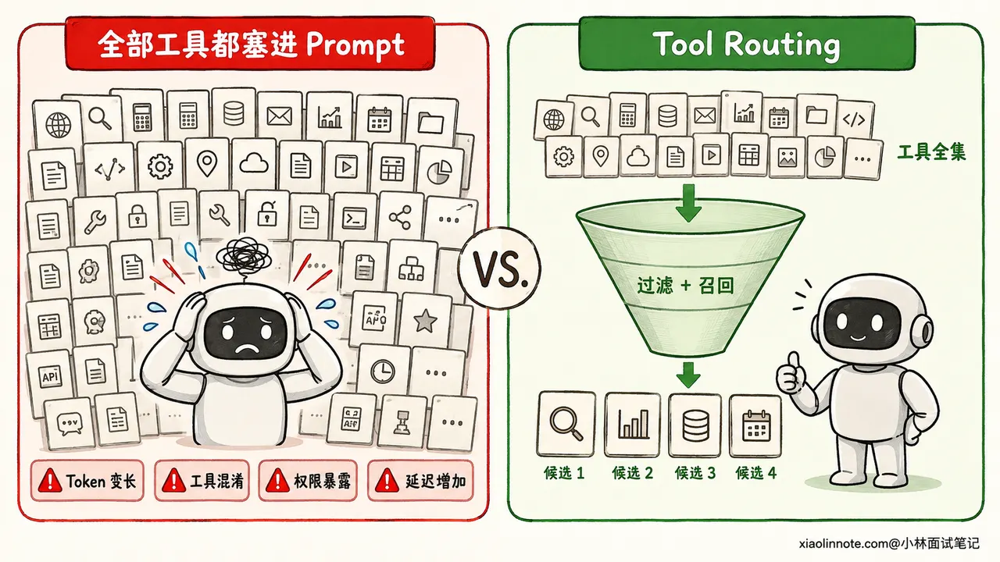
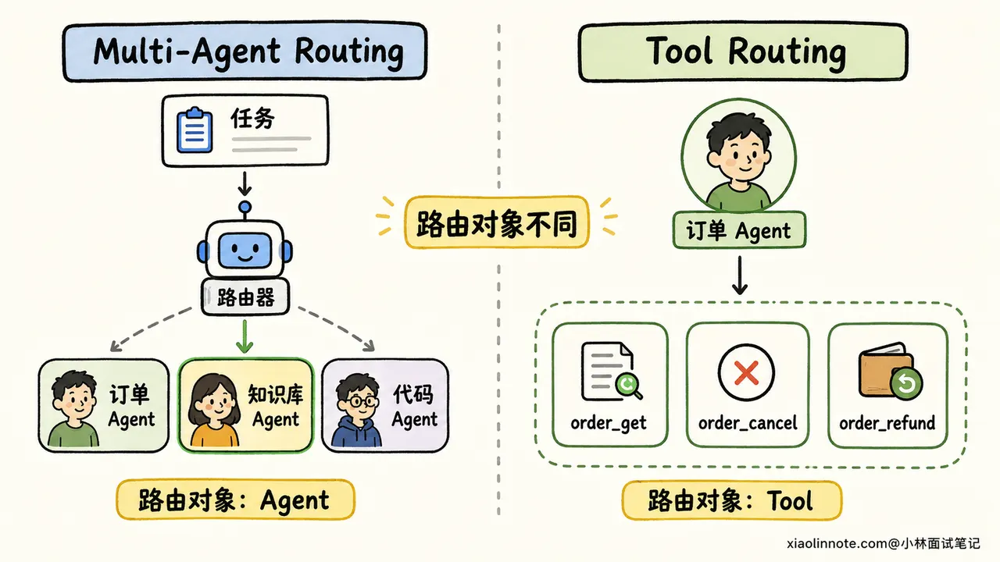
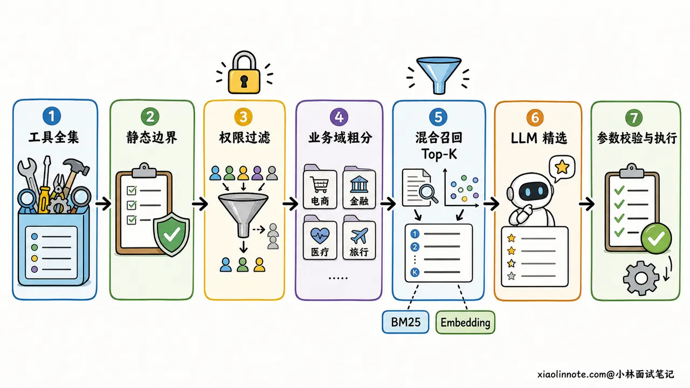
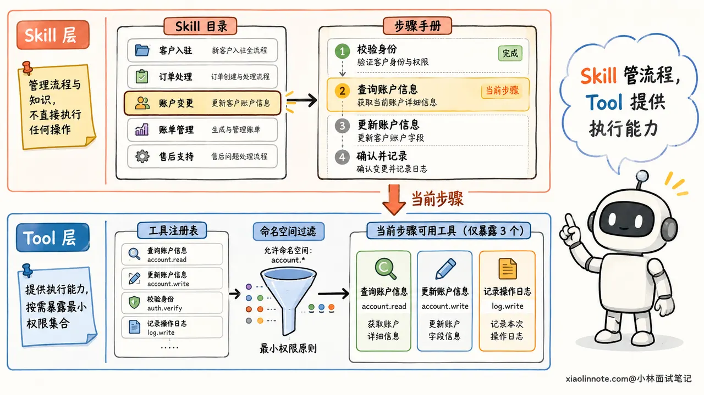
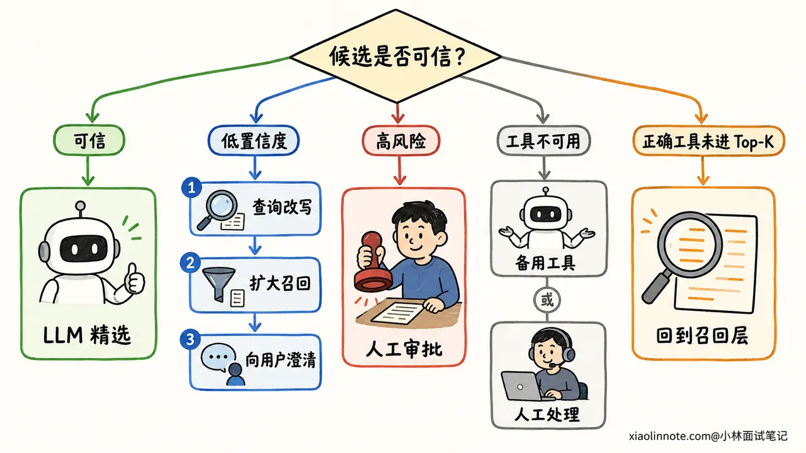

# 17. 工具很多时，Agent 如何做 Tool Routing，减少 Token 并避免选错工具？

> 来源：[https://xiaolinnote.com/ai/tools/17_tool_routing.html](https://xiaolinnote.com/ai/tools/17_tool_routing.html)

---

# 17. 工具很多时，Agent 如何做 Tool Routing，减少 Token 并避免选错工具？

👔面试官：如果一个 Agent 接了上百个工具，你会怎么做 Tool Routing？

🙋‍♂️我：把所有工具的名称、描述和参数都放进 Prompt，让大模型自己选，它理解能力强，工具多一点也没关系。

👔面试官：上百份 Schema 全塞进去，不仅占 Token，相似工具还会互相干扰。每轮都让模型读一遍，成本和延迟怎么控制？

🙋‍♂️我：那我先按业务分成几个 Agent，每个 Agent 只挂一类工具，这样不就行了吗？

👔面试官：这是 Multi-Agent Routing，决定任务交给哪个 Agent。Tool Routing 决定的是当前 Agent 此刻能看到、能选择哪些工具，两者不是一回事。即使拆成多个 Agent，每个 Agent 内部仍然可能有几十个工具。

🙋‍♂️我：那就用 Embedding 搜出最相似的几个工具，排第一的直接执行。

👔面试官：相似不等于可调用。用户权限、租户隔离、工具状态和参数条件都没检查，而且检索也可能漏召回。正确做法不是「向量搜一下就调用」，而是先做确定性过滤，再分层召回候选，最后让模型精选，并为低置信度和失败情况准备兜底。

工具一多，难点已经不只是让模型「会调用」，而是怎样让它在当前这一刻只看到少量、相关而且有权使用的工具。下面我们沿着一条完整链路把这件事说清楚。

## 💡 简要回答

工具很多时，我不会把全部 Schema 都塞给模型，而是做分层 Tool Routing。

首先维护统一的工具注册表，给工具补齐命名空间、标签、适用场景、参数 Schema、权限、风险等级和可用状态。每次请求先用产品范围、租户、用户角色、环境和当前任务状态做硬过滤，把无权调用或当前不可用的工具直接隐藏。

接着做两级召回。一级用规则或轻量分类模型判断工具类别，比如检索类、订单类、支付类；二级在相关类别内，用关键词、BM25、Embedding 或混合检索召回少量候选工具。最后只把候选工具的完整描述和 Schema 动态绑定给 LLM，让它判断是否调用、选哪个工具以及怎样填参数。

Tool Routing 路由的是「工具候选集」，Multi-Agent Routing 路由的是「任务由哪个 Agent 接手」，这两个层次可以配合，但不能混为一谈。

上线后我会同时看候选工具的 Recall@K、最终工具选择准确率、无工具场景的拒选准确率、参数合法率、任务成功率、工具 Schema Token、端到端延迟和越权暴露率。低置信度时优先澄清或扩大召回，不能让模型猜一个高风险工具直接执行。

## 📝 详细解析

### 为什么不能把全部工具都塞进 Prompt？

假设一个企业 Agent 同时接了客户、订单、支付、审批、知识库和运维系统，每个系统又暴露十几个工具。模型每轮调用前如果都要读完整的工具名称、描述和参数 Schema，会出现四类问题。

第一类是 Token 问题。工具定义本身属于模型输入，会和系统提示、聊天历史、检索资料一起占用上下文。工具越多，留给当前任务和证据的空间越少，输入成本也会增加。Prompt Cache 可以降低重复输入的费用和部分处理开销，但它没有让模型当前可见的工具变少，也不能从根本上解决候选混乱。

第二类是选择混淆。比如同时存在 `order_get`、`order_search`、`order_detail` 和 `after_sale_query`，它们的描述又都写着「查询订单信息」，模型很容易在相似选项之间选错。问题往往不是模型完全不懂，而是工具边界根本没有讲清楚。

第三类是权限风险。如果普通客服没有退款权限，却仍然把 `payment_refund` 暴露给模型，就等于让模型先看到了不该看的能力。即使最终执行层会拒绝，这种设计也扩大了误调用和提示词注入的攻击面。

第四类是延迟问题。更长的输入需要更多传输和模型预处理，模型还要在更大的候选空间里做判断。不过这里不要说成「路由一定更快」，因为额外的分类或检索也有耗时。工程目标是比较端到端延迟，在减少大模型输入与增加一次轻量路由之间找到平衡。



### 先分清 Tool Routing 和 Multi-Agent Routing

这两个概念名字相似，但路由的对象不同。

Tool Routing 回答的是：「当前这个 Agent 为完成这一步，应该看到哪些工具，最终调用哪个工具？」它的输入通常是用户请求、当前任务步骤、权限和工具元数据，输出是一个候选工具集合，或者在候选集合中选出的具体工具。

Multi-Agent Routing 回答的是：「当前任务或子任务应该交给哪个 Agent？」它路由的是研究 Agent、编码 Agent、审核 Agent这类角色，输出通常是下一位执行者或一次 Handoff。

举个例子，用户说「查询订单 A100，确认未发货后帮我取消」。Orchestrator 把任务交给订单 Agent，这是 Multi-Agent Routing；订单 Agent 当前先看到 `order_get`，确认状态后再看到 `order_cancel`，这是 Tool Routing。

两层路由可以同时存在。先选 Agent 能缩小业务边界，Agent 内部再选工具能缩小能力边界。但不能为了规避工具过多，就无原则地拆出几十个 Agent，否则只是把工具目录变成了 Agent 目录，任务切换、状态同步和调试成本反而会上升。



### 第一步，建立可路由的工具注册表

工具路由不能只依赖一个含糊的 `description`。先把每个工具整理成一张结构化的「工具卡片」，后面的规则过滤、检索和评测才有依据。

一张实用的工具卡片通常会包含这些信息：

| 信息 | 作用 | 示例 |
| --- | --- | --- |
| 唯一名称与命名空间 | 避免同名，支持按业务分组 | `orders.get_detail` |
| 能做什么 | 帮助理解工具能力 | 查询单个订单的实时详情 |
| 什么时候用 | 给出正向边界 | 已知订单号且需要状态、金额或商品明细 |
| 什么时候不用 | 区分相似工具 | 批量模糊查找订单时不要使用 |
| 输入输出 Schema | 约束参数与返回结构 | `order_id` 为必填字符串 |
| 标签 | 支持规则和检索 | 订单、查询、只读 |
| 权限与风险 | 决定能否暴露、是否审批 | `order:read`、低风险 |
| 状态与环境 | 排除不可用工具 | 仅生产环境、当前健康 |
| 版本与成本 | 灰度和调度参考 | v2、预估高延迟 |

命名最好体现「业务域 + 动作」，例如 `orders.search`、`orders.get_detail`、`orders.cancel`。描述里不仅要写功能，还要写适用条件和排除条件。参数 Schema 要有清楚的类型、必填项、枚举、格式和字段说明。

为什么这些细节很重要？因为路由器和最终的 LLM 都不是在读工具实现代码，它们主要依靠工具卡片来判断。如果两个工具的描述高度重叠，后面换再强的模型也只是在猜。

命名空间和标签还能提供稳定的一级索引。用户提到「退款」，可以先命中 `payments` 和 `orders` 两个命名空间，再在里面精确选择，而不是扫描整个企业工具库。

### 第二步，先做确定性过滤

分层路由的第一步不是相似度搜索，而是先把「绝对不能选」的工具排除掉。

静态过滤处理长期不变的边界。比如客服 Agent 只允许使用客户、订单和知识库工具，开发环境禁止挂真实支付工具，某个产品版本只启用 v2 接口。这类规则可以在 Agent 初始化或工具注册时用 Allowlist、Blocklist 固定下来。

动态过滤则跟每次运行的上下文有关。常见条件包括当前租户、用户身份与角色、功能开关、地区、会话阶段、任务状态、工具健康状态，以及是否已经收集到关键参数。OpenAI Agents SDK 的官方文档也提供了按运行上下文动态启停工具，以及对 MCP 工具做静态或动态过滤的机制。

这里有一个安全原则要特别强调：先鉴权，再做相关性召回。检索器只能在「当前请求有权看到的工具集合」里搜索，不能先从全库召回，再指望 Prompt 告诉模型「这个不能用」。而且隐藏工具只是减少暴露，执行工具时仍要在服务端重新鉴权，因为权限还可能取决于具体参数和资源归属。

例如同一个 `orders.get_detail` 工具，用户可能有权查询自己的订单，却无权查询另一个租户的订单。路由阶段只能判断这个工具是否大体可见，执行阶段还必须根据 `order_id` 再校验资源级权限。

### 第三步，用粗分类缩小业务域

经过权限过滤后，候选仍然可能很多，这时可以先做一级粗分类。

边界很清楚的请求优先用规则。例如明确出现订单号并询问物流，就把请求路由到「订单 + 物流」类别；当前工作流已经进入付款确认节点，就只开放支付查询类工具。规则速度快、可解释，也方便审计。

表达方式比较多、规则难以覆盖时，可以使用轻量分类模型或小参数 LLM，把请求分到检索类、查询类、生成类、执行类，或者订单、支付、审批等业务域。小模型只负责粗分，不直接决定高风险动作，所以输出空间小，成本也更容易控制。

粗分类要偏向高召回。如果一句话同时涉及「查订单」和「取消订单」，应该保留订单查询和订单操作两个类别，而不是只给一个标签。分类器不确定时，也可以跳过这一层，直接进入范围更大的工具检索。

### 第四步，在候选域里检索工具

工具达到几十个甚至更多时，可以把允许召回的工具卡片建成索引，根据当前请求或任务步骤检索 Top-K 候选。

关键词或 BM25 适合匹配产品名、接口名、字段名和缩写，比如用户明确提到「Jira」「SKU」或 `order_id`。Embedding 更擅长语义匹配，比如用户说「包裹还在路上吗」，也能召回描述为「查询物流轨迹」的工具。实际项目可以做混合检索，再用分数融合或轻量 Reranker 排序。

检索内容也不应只有一句工具描述。名称、业务标签、适用场景、排除条件、参数名和少量调用示例都可以进入索引。论文研究也表明，大规模工具选择可以先检索少量相关工具，再交给 LLM 做最终选择；对于复杂请求，还可以先把用户表达改写成更适合检索工具说明的查询。

但要记住，工具检索追求的是「别漏掉正确工具」，不是「排第一就直接执行」。Embedding 相似度只表达语义接近，不代表用户有权限、参数满足，也不代表这个工具一定能完成任务。检索结果应该进入下一层精选和校验。



### 第五步，只把候选工具动态绑定给 LLM

前面几层筛完之后，才轮到大模型做自己擅长的精细语义判断。系统把当前任务上下文，以及少量候选工具的完整描述和 Schema 绑定给模型，让它完成三件事：判断是否真的需要工具、选择一个或多个工具、填写结构化参数。

这种「先召回，后精选」的设计，把 LLM 从上百个相似选项中盲选，变成在一个小候选集里做判断。OpenAI 和 Anthropic 的官方工具搜索能力都支持延迟加载工具，也就是工具先留在目录中，需要时再把相关定义加载进模型上下文。OpenAI 还建议用命名空间组织相关工具，Anthropic 的工具搜索则可以根据名称、描述、参数名和参数说明发现工具。

少数高频、低风险工具可以常驻，比如只读搜索和帮助工具；长尾工具按需加载。这样能减少一次额外检索的概率，也不会让大批低频 Schema 长期占着上下文。

动态绑定只是决定「模型此刻看见什么」，执行前仍要经过参数 Schema 校验、权限校验、风险策略和必要的人工审批。Tool Routing 不能替代执行层安全。

下面用一段伪代码把这条链路串起来：

```
def route_tools(query, context, registry):
    # 先执行硬过滤，未经授权的工具不能进入检索范围
    allowed = registry.filter(
        product=context.product,
        tenant=context.tenant,
        role=context.role,
        environment=context.environment,
        healthy_only=True,
    )

    # 用规则或轻量分类器召回一个或多个业务类别
    domains, confidence = classify_domains(query, context.task_state)
    if confidence >= 0.7:
        allowed = allowed.in_domains(domains)

    # 混合检索只负责召回，不直接触发工具执行
    candidates = hybrid_retrieve(
        query=query,
        tool_cards=allowed,
        top_k=6,
    )

    # 返回少量完整 Schema，交给主模型做最终选择和参数生成
    return bind_full_schemas(candidates)
```

示例里的阈值和 Top-K 只是说明控制点，不是通用最优值。真实项目要根据评测集中的召回率、Token、延迟和误选情况调参。

### Skill 渐进加载怎样参与 Tool Routing？

Skill 和 Tool 可以一起解决上下文膨胀，但分工不一样。

Skill 更像任务操作手册。Agent 启动时先看 Skill 的名称和简短描述，匹配到当前任务后再加载详细步骤，需要模板或脚本时继续按需读取。这种渐进式加载避免把所有工作流程一次性塞进上下文。

Tool 是可执行能力，Tool Routing 决定当前步骤要暴露哪些能力。一个 Skill 被选中后，可以进一步告诉 Agent「这项任务先使用 `orders.get_detail`，满足条件后再使用 `orders.cancel`」，也可以把检索范围缩小到某个工具命名空间。

所以常见链路是「用户请求 -> 匹配 Skill -> 加载任务流程 -> 根据当前步骤路由 Tool」。Skill 能帮助缩小工具候选，但它不能替代权限过滤和执行鉴权，更不能因为 Skill 里写了某个工具名，就绕过用户当前的权限。



### 工具描述和 Schema 质量决定路由上限

路由链路再复杂，也救不了一组互相说不清边界的工具。

工具名称要具体，避免 `query_data`、`process` 这类泛化命名。描述应该同时回答「做什么」「何时用」「何时不用」「返回什么」。相似工具之间要直接写出差异，例如「已知唯一订单号时使用详情查询，按手机号或时间范围查找时使用订单搜索」。

参数 Schema 要尽量收紧。能用枚举就不要放任任意字符串，必填项要明确，日期、ID 和数值范围要写清楚。少量高质量的正例和反例，也能帮助模型理解调用边界。Schema 约束解决的是格式合法性，业务合法性仍要在工具内部校验。

如果两个工具总是被混淆，不要只修改 Prompt。先检查它们是不是职责重叠，能否合并，或者把一个大而全的工具拆成边界清楚的查询与执行工具。工具设计本身，就是 Tool Routing 的一部分。

### 怎么评估 Tool Routing？

只看最终回答对不对，很难知道问题出在召回、精选、参数还是执行。评测时要把链路拆开看。

第一层看候选召回。单工具任务可以看 Recall@K，也就是正确工具是否进入 Top-K；多工具任务还要看所需工具是否召回完整，避免只找到了其中一个。与此同时记录候选集大小和工具 Schema Token，防止为了提高召回把候选集无限放大。

第二层看模型精选。关注最终工具选择准确率、相似工具误选率、该直接回答时是否错误调用工具，以及应该调用工具时是否漏调。参数层再看 Schema 合法率、必填参数完整率和参数事实正确率。

第三层看业务结果。包括任务成功率、工具执行失败率、端到端延迟、模型调用成本、澄清率和人工接管率。安全上还要单独观察未授权工具暴露率、越权调用拦截情况和高风险操作审批覆盖率。

评测集不要只收集「一句话明确命中一个工具」的简单题，还要加入相似工具形成的 Hard Negative、多意图请求、不需要工具的请求、缺少参数的请求、无权限请求和历史 Badcase。上线后保留每层路由的候选、分数、过滤原因和最终调用 Trace，出错时才能判断是召回漏了，还是模型选错了。

### 路由失败怎么兜底？

Tool Routing 一定会有不确定的时候，系统必须让这些不确定和失败保持可控。

如果没有候选或召回置信度太低，可以改写查询后扩大类别和 Top-K 再检索一次。仍然不确定时，让用户补充缺失信息，比随便猜一个工具更可靠。

如果多个相似工具分数接近，低风险只读场景可以让 LLM 根据更完整的描述精选；涉及付款、删除、发信等高风险动作时，应进入确定性规则或人工审批，不能靠相似度直接执行。

如果首选工具不可用，可以切换到同能力的备用工具，或者降级为只读查询和人工处理。模型输出了候选集之外的工具名时，运行时必须拒绝，不能尝试「将错就错」地映射执行。

还有一种容易忽略的失败，是正确工具根本没进入 Top-K。这时让同一个 LLM 在错误候选里反思没有意义，应该回到召回层，放宽类别、改写查询，或者走默认的工具搜索入口。



## 🎯 面试总结

回到开头，把上百个工具全部塞给模型，会同时带来 Token 占用、相似工具混淆、权限暴露和延迟压力。只用 Embedding 取第一名直接执行也不稳，因为相关性不是可调用性，更不是授权。

面试时我会先说清楚 Tool Routing 和 Multi-Agent Routing 的边界。前者决定当前 Agent 能看到和调用哪些工具，后者决定任务交给哪个 Agent。它们可以上下分层配合，但解决的不是同一个问题。

然后讲完整方案：先建设包含命名空间、标签、适用边界、Schema、权限和状态的工具注册表；再按产品、租户、角色和任务状态做确定性过滤；接着用规则或轻量模型粗分业务域，用 BM25、Embedding 或混合检索召回 Top-K；最后只把少量完整 Schema 动态绑定给 LLM 做精选和参数生成，执行前再做服务端鉴权与风险控制。

最后补上工程闭环。用 Recall@K 保证候选不漏，用最终选择准确率、参数合法率和任务成功率检查模型，用 Token、延迟和成本衡量收益，用无工具拒选、越权暴露和审批覆盖率守住安全边界。低置信度时扩大召回或向用户澄清，高风险动作宁可不执行，也不能让模型猜。

---

对了，AI Agent的面试题会在「**公众号@小林面试笔记题**」持续更新，林友们赶紧关注起来，别错过最新干货哦！


