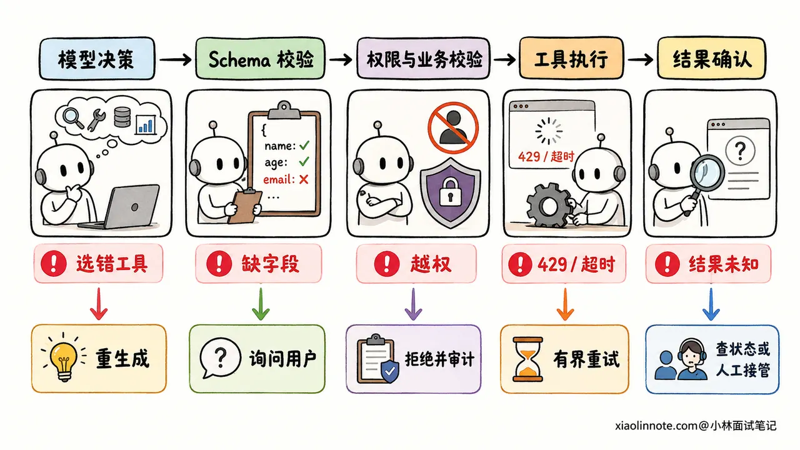
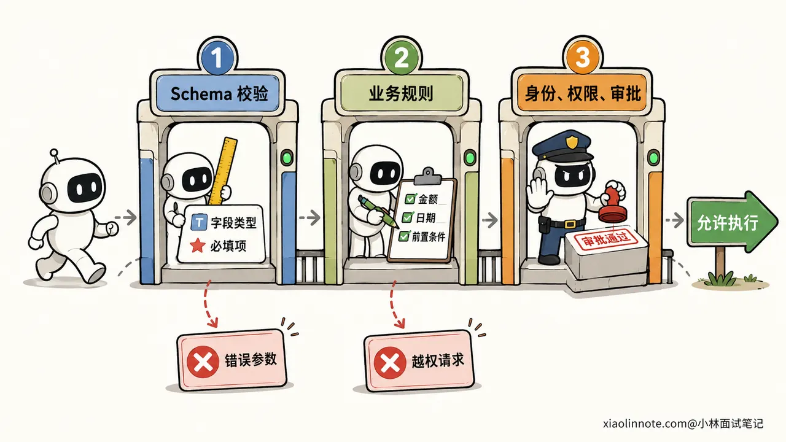
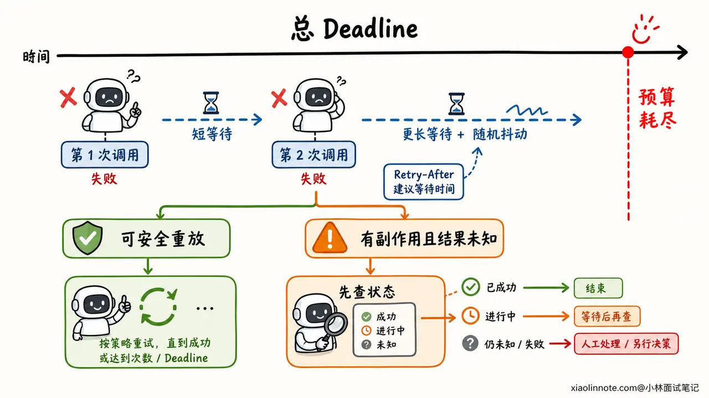
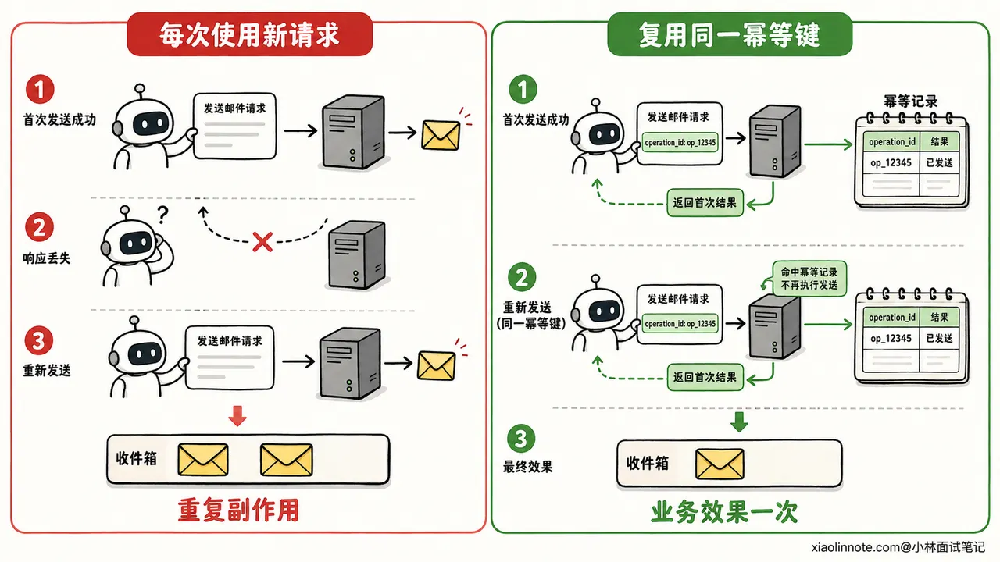

# 18. 工具调用格式非法、参数错误、超时或失败时，Agent 如何容错？

> 来源：[https://xiaolinnote.com/ai/tools/18_tool_reliability.html](https://xiaolinnote.com/ai/tools/18_tool_reliability.html)

---

# 18. 工具调用格式非法、参数错误、超时或失败时，Agent 如何容错？

👔面试官：Agent 调工具时遇到格式非法、参数错误或者接口超时，你会怎么处理？

🙋‍♂️我：统一重试三次，失败后再返回错误，这样成功率会高一些。

👔面试官：参数错误和鉴权失败重试三次有什么用？下游已经过载时，所有请求一起重试，还可能把服务压得更严重。哪些错误能重试，哪些不能？

🙋‍♂️我：那就只重试超时和 5xx，使用指数退避。格式不合法时，把原始输出再交给模型修一遍。

👔面试官：如果超时发生在发邮件之后、响应返回之前呢？邮件可能已经发出，你直接重试就会发两封。还有，模型修好的参数就一定有权限执行吗？

🙋‍♂️我：可以给工具加幂等键，保证 exactly-once。权限规则也写进 Prompt，让模型自己检查。

👔面试官：幂等键需要服务端配合，Prompt 也代替不了服务端鉴权。网络断开后，调用方甚至不知道第一次操作有没有成功。你还要考虑调用前校验、结果未知、Checkpoint、人工接管和审计，不能用一句 exactly-once 把问题盖过去。

工具调用的容错难点是判断故障发生在哪一层，以及一次失败有没有产生外部副作用。多写几个 `try/except` 解决不了这两个问题。

## 💡 简要回答

我会把工具调用拆成「决策 -> 校验 -> 执行 -> 确认 -> 恢复」五个阶段，每个阶段使用不同的处理方式。

模型选错工具、JSON 不合法或缺少参数时，先用结构化输出和 Schema 拦截，再把明确的校验错误交给模型重生成。参数满足 Schema 后，服务端还要检查业务约束、用户身份、工具权限和风险级别，不能信任模型自己判断权限。

进入执行阶段后，我只对限流、连接失败和部分 5xx 这类瞬时故障做有界重试，并同时满足三个条件：调用可以安全重放、总时间预算还有余量、重试次数没有超限。退避要加抖动，遇到 `Retry-After` 就尊重服务端建议。参数错误、权限不足和明确的业务失败应该修参数、重新规划或询问用户，不能原样重试。

付款、发邮件、创建订单这类工具还要处理「结果未知」。我会在第一次调用前生成幂等键并写入 Checkpoint，重试和恢复时复用同一个键；超时后先按幂等键查询状态，确认没有执行再决定是否重试。查不清时暂停任务并转人工，避免重复副作用。

系统还需要熔断、降级、故障转移和统一的结构化错误。Trace 里记录每次调用的工具版本、参数摘要、耗时、重试决策、幂等键摘要和最终状态，敏感参数要脱敏，方便告警、复盘和审计。

## 📝 详细解析

### 先分清故障，重试策略才不会用错

Agent 一次工具调用至少经过模型决策、宿主程序校验、远程执行和结果回传。任何一层都可能失败，但同一个「失败」提示背后的含义差别很大。

模型可能选了不存在的工具，或者输出缺少必填字段。这属于决策与格式问题，工具尚未执行。参数通过类型校验后，也可能违反业务规则，比如退款金额超过可退余额；用户还可能没有退款权限。这两类错误都应该在调用前拦住。

请求发出去之后，系统会遇到连接失败、429 限流、服务端 5xx 和超时。工具也可能正常返回一个业务失败，比如订单不存在、库存不足。最麻烦的是调用方没有收到响应，下游却可能已经完成操作，此时结果应标记为 `unknown`，不能擅自当成失败。



工程上可以把错误归到下面几类：

| 故障类别 | 常见例子 | 推荐动作 |
| --- | --- | --- |
| 模型决策或格式错误 | 工具名不存在、JSON 非法、缺少字段 | 返回结构化校验反馈，让模型有界重生成 |
| 参数或业务校验失败 | 日期范围错误、订单不存在、余额不足 | 修正可确定的格式，缺信息则询问用户，业务失败则重新规划 |
| 鉴权与权限失败 | 凭证失效、用户无权执行 | 由鉴权组件刷新可刷新的凭证，越权请求直接拒绝并审计 |
| 瞬时基础设施故障 | 连接失败、429、部分 5xx | 在安全重放和预算允许时做有界重试 |
| 明确执行失败 | 下游确认事务已回滚 | 根据业务规则降级、换工具或结束任务 |
| 副作用结果未知 | 写请求超时、连接在响应前断开 | 使用幂等键查状态或对账，不能盲目重试 |

这张表也解释了一个常见误区：HTTP 状态码只能提供线索，重试决策还要结合工具语义和执行阶段。比如连接建立前失败，服务端通常没有收到请求；读取响应时超时，服务端可能已经执行完了。

### 调用前要过三道门

第一道门是结构校验。能使用模型原生的结构化输出或受约束解码时，先约束输出；宿主程序仍要按 JSON Schema 校验工具名、字段类型、必填项、枚举和取值范围。系统可以做少量没有歧义的规范化，比如去掉首尾空格，但不能靠正则猜出收件人、金额或文件路径。

第二道门是业务校验。`amount` 是数字，只能说明格式正确，不能说明金额可退；`date` 符合格式，也不能说明会议时间在允许范围内。工具适配层要查询当前业务状态，检查资源是否存在、版本是否冲突、前置条件是否满足。

第三道门是权限与风险校验。宿主程序依据已经认证的用户身份计算权限，并在服务端执行最小权限控制。删除数据、付款、群发消息等高风险动作还要进入审批。模型看到的 Prompt 可以解释规则，却不能充当安全边界。



### 错误结果也要有统一协议

不少 Agent 遇到工具异常时，直接把堆栈或一句「调用失败」塞回模型。前者可能泄露内部路径和密钥，后者又缺少下一步决策需要的信息。

工具适配层应该返回统一的错误信封，例如：

```
ok: false
call_id: tc_8f21
tool: send_email
error:
  category: rate_limit
  code: UPSTREAM_429
  retryable: true
  outcome: not_started
  retry_after_ms: 1200
  safe_message: 服务暂时限流
```

`category` 供策略引擎分类，`retryable` 表示当前故障是否可能恢复，`outcome` 则说明副作用状态是 `not_started`、`failed`、`succeeded` 还是 `unknown`。模型只接收经过脱敏的 `safe_message` 和必要字段，原始异常留在受控日志中。

`retryable: true` 只是一个条件。工具本身无法安全重放、任务总时限已经耗尽，或者用户已经取消任务时，调度器都不应该继续重试。

### 重试要同时受到次数和时间约束

可靠的重试策略会同时看「错误类型、调用语义、尝试次数、剩余时间」四项信息。

连接失败、429、503 等瞬时故障可以进入重试候选。调度器为每次尝试设置超时，也为整段任务设置总 Deadline；每次准备重试前，都要确认退避等待和下一次调用不会超过剩余预算。下游返回 `Retry-After` 时优先遵守它，否则使用有上限的指数退避，并加入随机抖动，让大量实例不要在同一时刻再次冲击下游。

系统还应把重试放在一个明确的层级。SDK、工具适配层、Agent 调度层如果各重试三次，请求次数会成倍放大。通常让最了解幂等性和任务预算的一层负责重试，其他层关闭自动重试或把尝试次数纳入同一个预算。

取消也要向下传播。用户停止任务或总 Deadline 到期后，调度器应取消尚未开始的调用，并通知正在执行的工具停止可中断工作。客户端结束等待，不代表服务端代码会自动停止，工具实现仍要检查取消信号并释放连接、线程和临时文件。



### 熔断、降级和故障转移各解决什么问题

短暂抖动适合重试，持续故障则要熔断。熔断器在连续失败或错误率达到配置条件后进入 Open 状态，让后续调用快速失败；等待冷却时间后放少量探测请求进入 Half-Open，探测成功再回到 Closed。这样可以减少无效请求占用线程和连接，也给下游留出恢复空间。

熔断后，Agent 可以返回缓存数据、切换只读模式，或者调用语义等价的备用服务。降级结果要明确告诉模型数据是否陈旧、缺少哪些字段，避免模型把残缺结果包装成完整答案。

故障转移也有边界。两个搜索服务可以通过统一结果协议互相替换；两个付款渠道如果不共享交易状态和幂等范围，贸然切换可能产生两笔扣款。备用工具必须满足相同的权限、数据一致性和副作用约束，调度器才能自动切换。

### 幂等键有明确的生效边界

有副作用的调用要在第一次执行前生成稳定的幂等键，例如由 `run_id + step_id` 组成。后续重试、进程重启和人工恢复都复用这个键，不能每次尝试都生成新键。

服务端收到请求后，要把「幂等键、请求参数摘要、处理状态、最终结果」写入持久化存储。同一个键和相同参数再次到来时，服务端返回已有结果；同一个键却带着不同参数时，服务端应该拒绝，防止调用方误用。业务写入与幂等记录还要放在同一个事务边界内，或者使用事务消息、Outbox 和对账补偿保证状态能收敛。



「Exactly-once」很容易被说得过头。幂等键只有在服务端识别它、保留记录并覆盖完整副作用边界时才有效。下游系统不支持去重、记录已经过期、一次工具调用跨越多个系统，都可能留下部分成功。工程上更准确的目标是允许请求至少一次到达，再用幂等、去重、状态查询和补偿，让业务效果在约定范围内只发生一次。

### Checkpoint 决定故障后从哪里继续

长任务不能只保存聊天记录。调度器在副作用调用前写入 Checkpoint，记录当前步骤、工具名、参数摘要、幂等键和 `pending` 状态；拿到确定结果后，再把该步骤更新为 `succeeded` 或 `failed`。

进程重启后，恢复器先读取 Checkpoint。已经成功的步骤直接跳过；明确失败且满足策略的步骤可以重新规划；状态为 `pending` 或 `unknown` 的步骤先向下游查询，不能重新跑完整计划。把模型推理节点和副作用执行节点分开，也能避免恢复时让模型重新生成一次付款或发送动作。

状态查询仍无法确认结果时，系统应该暂停运行，保存现场并交给人工。人工可以批准重试、修改参数、执行补偿或终止任务。高风险操作也可以在首次执行前主动暂停，让用户确认收件人、金额和影响范围。

### 监控与审计要能还原一次调用

线上告警只有一句「工具失败」没有排查价值。一次 Trace 至少要串起 `run_id`、`step_id` 和 `tool_call_id`，并记录工具及 Schema 版本、模型与 Prompt 版本、参数脱敏摘要、调用方身份、开始结束时间、每次尝试、错误类别、重试或降级决策、Checkpoint 状态和最终结果。

指标可以关注各工具成功率、延迟分位数、重试率、熔断状态、`unknown` 结果数量、幂等去重次数和人工接管量。审计日志还要记录谁批准了高风险动作、批准了哪些参数，以及系统执行了什么。参数和工具结果可能含有个人信息或密钥，日志要做脱敏、访问控制和保留期限管理。

把调用链记录完整后，你才能回答三个生产问题：失败发生在哪一层，系统为什么选择重试或停止，这次副作用最终有没有发生。

## 🎯 面试总结

回答这道题，我会先强调「先分类，再处理」。模型格式错误、业务参数错误、鉴权失败、瞬时故障和副作用结果未知，处理方式不同，统一重试会放大故障，还可能造成重复扣款或重复发送。

调用前用结构化输出与 Schema 检查格式，再由服务端完成业务校验、权限控制和高风险审批。执行时只对满足安全重放条件的瞬时故障做有界重试，结合总 Deadline、单次超时、指数退避、抖动和取消传播。持续故障进入熔断，再根据工具语义选择降级或故障转移。

有副作用的调用要在首次执行前保存 Checkpoint 和稳定幂等键。超时后先查询状态，无法确认就转人工。幂等机制需要服务端与下游共同支持，它无法提供没有边界条件的 exactly-once 保证。

最后用结构化错误、Trace、指标和审计把整条链路串起来。面试官继续追问时，可以拿「发邮件后响应丢失」举例，按「校验 -> Checkpoint -> 携带幂等键执行 -> 超时查状态 -> 确认后恢复或转人工」讲完整闭环。

---

对了，AI Agent 的面试题会在「**公众号@小林面试笔记题**」持续更新，林友们赶紧关注起来，别错过最新干货哦！


