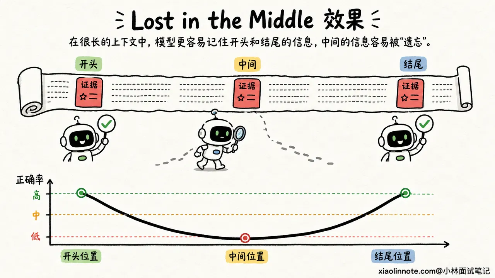
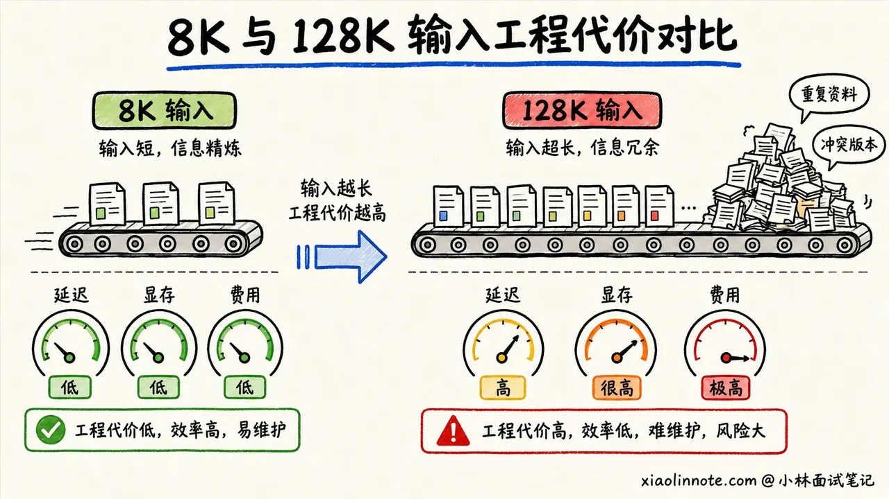
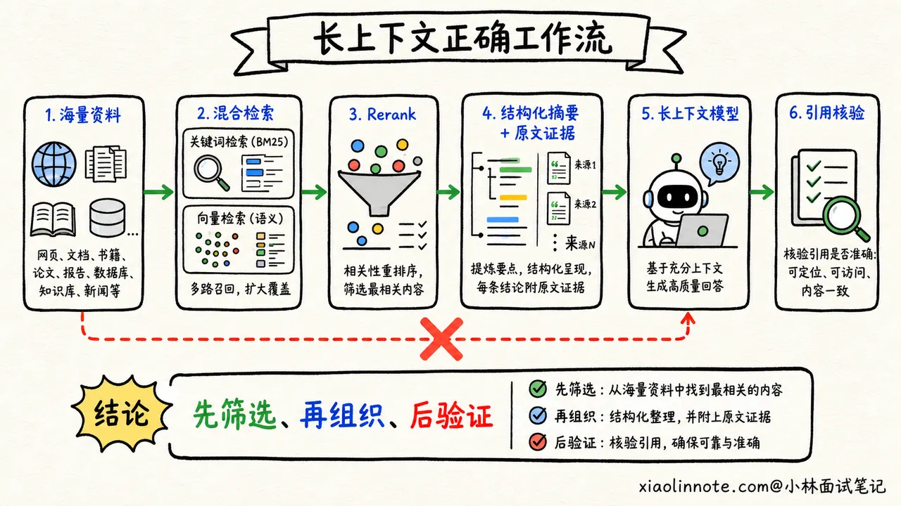
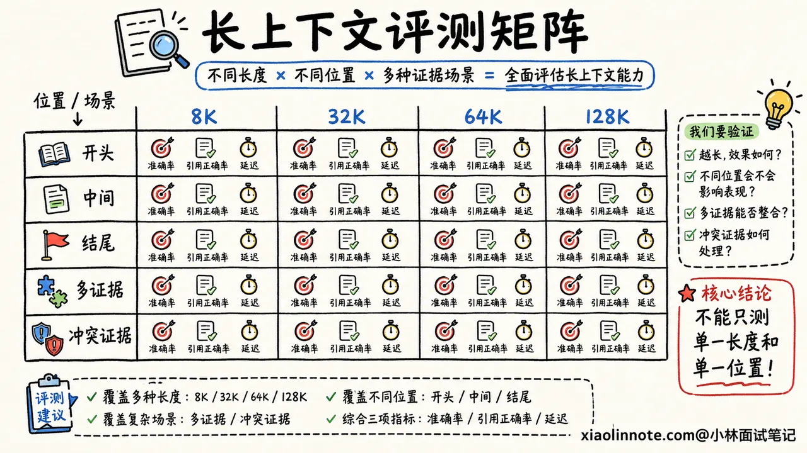

# 23. 为什么长上下文会出现 Lost in the Middle？上下文窗口越大越好吗？

> 来源：[https://xiaolinnote.com/ai/llm/23_long_context_lost_middle.html](https://xiaolinnote.com/ai/llm/23_long_context_lost_middle.html)

---

# 23. 为什么长上下文会出现 Lost in the Middle？上下文窗口越大越好吗？

👔面试官：为什么长上下文会出现 Lost in the Middle？上下文窗口是不是越大越好？

🙋‍♂️我：上下文太长以后，模型记不住中间的内容，所以会把它忘掉。把上下文窗口继续扩大，模型就能记住了。

👔面试官：窗口能装进去，为什么就等于模型能用好？一个模型能接收 100 万 token，只能说明请求不会因为超长被拒绝，不能说明它能准确找到第 50 万个 token 里的证据。

🙋‍♂️我：那应该是位置编码外推的问题，RoPE 没有处理好中间位置，所以模型找不到。

👔面试官：如果全是位置编码的问题，为什么同一个模型常常能找到开头和结尾的信息，却更容易漏掉中间的信息？注意力分配、训练数据和任务干扰都不考虑吗？

🙋‍♂️我：那把所有资料都塞进去，再让模型多思考一会儿，应该总能找到吧。

👔面试官：资料越多，噪声和冲突也越多，预填充延迟、显存占用和调用成本还会一起上涨。长窗口是容量，不是质量保证。先搞清楚「装得下」和「用得好」的区别。

这道题最容易踩的坑，就是把上下文窗口当成电脑硬盘，误以为容量越大，模型就一定看得越全、答得越准。

## 💡 简要回答

我不会把长上下文能力简单理解成「模型最多能接收多少 token」。最大上下文窗口只是输入上限，真正有用的是模型在不同长度、不同位置和不同干扰强度下，能不能稳定找到证据并完成推理，也就是它的有效上下文能力。

Lost in the Middle 指的是关键信息放在长文本中间时，模型的利用效果往往比放在开头或结尾更差。它不只是位置编码造成的，还和训练时见过的长度分布、注意力的位置偏置、无关内容对注意力的稀释，以及任务需要跨段整合多少信息有关。

所以窗口不是越大越好。输入越长，稠密 Self-Attention 的计算量增长很快，KV Cache、首 token 延迟和调用成本也会增加。工程上我会先做检索和重排，只保留真正相关的片段，再配合结构化摘要、清晰分区和关键约束布局，最后用不同长度、不同证据位置的测试集验证，而不是把所有资料一次性塞给模型。

## 📝 详细解析

### 先分清「训练长度」「窗口上限」和「有效长度」

看到模型介绍里写着支持 128K、200K，甚至 1M 上下文，很多林友会自然地理解成：「只要内容没超过这个数，模型就能全部记住。」

其实这里混在了一起的是三件不同的事。

第一件事是**训练时见过的长度**。如果模型在预训练或长上下文继续训练时，大部分样本都比较短，那么它即使通过位置编码扩展接受了更长输入，也不代表它已经学会在超长文本中稳定检索和推理。

第二件事是**接口允许的最大窗口**。它表示输入 token 加输出 token 不能超过某个上限，回答的是「能不能装进去」。窗口扩展可以通过长文本继续训练、位置插值、YaRN 等办法完成，但扩到更长并不等于所有任务都能无损外推。

第三件事是**有效上下文长度**。它回答的是「装进去以后能不能用好」。同样一段证据，放在 8K 输入里能答对，放进 100K 的大量干扰内容中就可能答错。对真实业务来说，第三个数字往往比模型标称的窗口大小更重要。

### Lost in the Middle 到底是什么现象？

假设我们把一条能直接回答问题的证据，分别放在长文档的开头、中间和结尾，再让模型回答同一个问题。很多模型会呈现一种类似 U 形的表现：证据在开头和结尾时更容易答对，放在中间时正确率更容易下降。

这就是 Lost in the Middle，直译过来是「迷失在中间」。它不是说模型完全看不见中间的 token，而是说在长输入和大量干扰下，模型没有稳定地把中间那段信息选出来，并用于最后的回答。

为什么开头和结尾会占便宜？开头通常放系统指令、任务背景和核心定义，模型在训练中见过大量这种结构；结尾离当前要生成的答案最近，用户问题也经常出现在这里。久而久之，模型可能形成对开头和近邻内容更强的利用倾向。

中间内容则很容易夹在大量相似段落里。如果关键信息只出现一次，周围又有几十段看似相关的文字，它虽然在窗口内，却未必能赢得足够的注意力。

### 为什么不能只怪位置编码？

位置编码确实会影响长上下文。模型如果推理时使用了训练阶段从没见过的位置范围，位置表示可能失真，近距离和远距离的关系也可能判断不准。但把 Lost in the Middle 全部归因于 RoPE 或其他位置编码，是把问题想简单了。

更完整地看，至少还有三股力量一起在起作用。

第一股是**训练分布**。模型训练时接触到的文本长度、关键信息所在位置、长文本任务类型，会影响它学会怎样使用上下文。如果训练样本里的答案经常在开头或结尾，中间位置自然练得少。

第二股是**注意力稀释和干扰**。输入从 10 段扩到 1000 段以后，需要竞争注意力的 token 多了很多。此时真正相关的证据可能被重复信息、相似表述和错误版本包围。模型不是没有读到，而是没有把它选成回答依据。

第三股是**任务难度**。从长文中找一个唯一编号，和先找到三个分散证据、再判断它们的时间和因果关系，完全不是一个难度。窗口长度相同，后者更容易失败。因此长上下文评测不能只做简单的「大海捞针」。

### 上下文窗口越大，代价也越大

长窗口当然有价值。阅读整份合同、分析大型代码仓库、总结多轮会话时，如果窗口太小，关键信息连放都放不进去。但问题是，窗口越大并不是免费的。

对于标准的稠密 Self-Attention，序列长度从 `n` 增长后，注意力计算量大致按 `n²` 增长。Flash Attention 能明显降低中间结果的显存读写和显存占用，但它不会把稠密注意力的计算关系直接变成线性。

推理时，已有 token 的 K、V 还要放进 KV Cache。序列越长，KV Cache 通常越大，长输入的 Prefill 时间也越久。对 API 调用来说，更多输入 token 还意味着更高成本。即使模型最终回答只用了其中两段证据，前面的海量文本也已经参与了处理。

还有一种更隐蔽的代价叫**质量退化**。塞入更多资料，看起来是在增加信息，实际上也可能引入旧版本、重复片段、无关内容和彼此矛盾的描述。模型要先从噪声里找信息，再进行推理，任务反而更难。

### 工程上怎么让长上下文真正好用？

面对一大堆资料，第一反应不应该是「全部塞进去」，而应该先问：「完成当前任务，模型到底需要哪些信息？」

如果是在文档问答场景，我会先把问题送入检索链路，通过关键词检索和向量检索召回候选片段，再用 Rerank 把真正相关的内容排到前面。这样走完的是「全量文档 -> 候选片段 -> 高相关证据 -> 模型回答」，模型面对的不是一整座仓库，而是当前问题真正需要的几页资料。

如果任务确实需要全局信息，比如总结一本书或分析一整份代码库，就不能只取几个 chunk。这时可以采用分层摘要，先对章节、模块分别生成有出处的结构化摘要，再由上层汇总；对于数字、约束、待办和接口定义这类不能模糊压缩的信息，则单独抽取成结构化字段，不要混在自然语言摘要里。

提示词布局也很重要。系统指令、用户目标、不可违反的约束要分区清楚，证据要带标题、来源和段落编号，问题可以在证据之后再次明确。对最关键的限制条件，可以放进独立的任务规格区，而不是埋在几十页聊天历史中等模型自己发现。

另外，压缩不是越狠越好。摘要之后必须保留回查原文的引用或 chunk ID，一旦回答涉及数字、合同条款等高风险信息，就回到原文核验。这样既减少上下文，又不会让摘要变成新的信息瓶颈。

### 长上下文应该怎么评测？

只拿一篇短文章问两个问题，测不出长上下文能力。只把一串随机数字藏进长文本，再看模型能不能找回来，也不够接近真实业务。

比较可靠的做法，是让测试集同时改变几个条件：输入长度从 8K、32K 增长到目标长度；关键证据分别放在开头、中间和结尾；干扰文档从少到多；任务同时包含单点检索、多证据汇总、时间排序和冲突判断。

指标也不能只看答案准确率。还要看证据引用是否正确、遗漏了多少关键事实、是否引用了干扰内容，以及长度增长以后首 token 延迟、总耗时和单次调用成本增加了多少。

最终要得到的不是一句「这个模型支持 128K」，而是一条更有用的结论：「在我们的合同审核任务里，输入不超过 40K、证据分布在任意位置时，准确率和延迟都能达到要求。」这才是项目真正能使用的有效长度。

## 🎯 面试总结

回到开头的问题，面试时我会先把一句话说清楚：**最大上下文窗口表示「装得下多少」，不代表模型「稳定用得好多少」**。训练时见过的长度、接口支持的长度和业务里的有效长度，是三个不同概念。

Lost in the Middle 表现为关键信息放在长文本中间时，比放在开头或结尾更容易被忽略。它与位置编码有关，但不能只怪位置编码，还要考虑训练分布、位置偏置、注意力稀释、干扰内容和任务本身的推理难度。

窗口越大，稠密注意力的计算量、KV Cache、Prefill 延迟和输入成本通常也越高，噪声与冲突信息还可能让答案质量下降。所以工程上更合理的做法是先检索和重排，再通过分层摘要、结构化抽取、清晰布局和引用回查，把真正有用的信息交给模型。

最后要用不同长度、不同证据位置和不同任务难度做评测，找出当前业务的有效上下文长度。能把「容量、质量、成本、评测」这四层都讲清楚，这道题就不只是背过概念，而是真正理解了长上下文如何落地。
